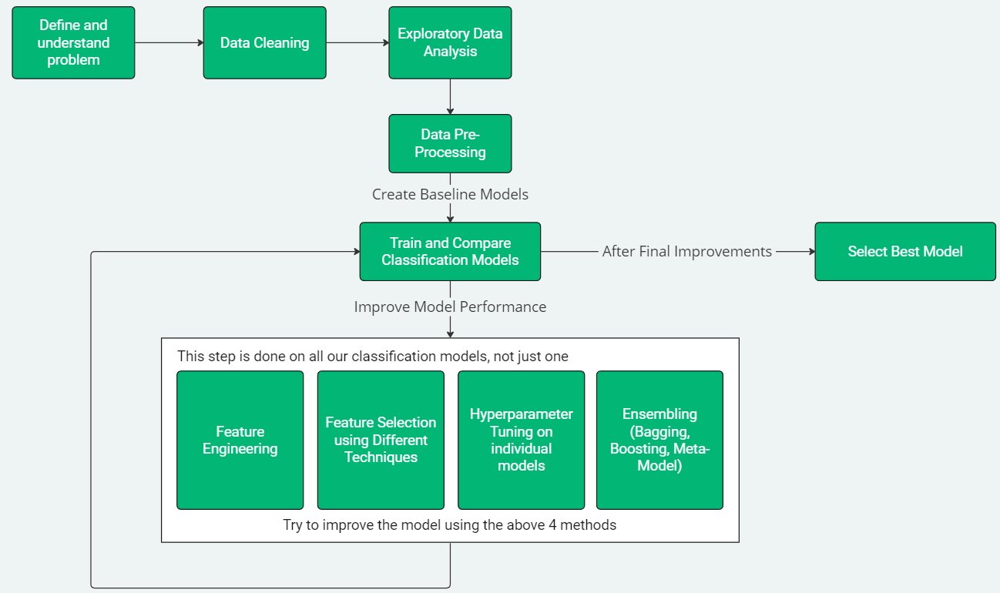

# Predicting Hotel Reservation Cancellations
## How To Navigate Project:
1. [Data Cleaning Notebook](/1%20-%20Data%20Cleaning.ipynb)
2. [Exploratory Data Analyis Notebook](/2%20-%20Data%20Exploration.ipynb)
3. [Data Pre-processing Notebook](/3%20-%20Data%20Pre-Processing.ipynb)
4. [Initial Classification Models Notebook](/4%20-%20ClassificationModels.ipynb)
5. [Feature Engineering Notebook](/5%20-%20Feature%20Engineering.ipynb)
6. Applying Feature Selection + Hyperparameter Tuning On Individual Models
   1. [Logistic Regression Notebook](/6.1%20-%20Logistic%20Regression.ipynb)
   2. [K Nearest Neighbour Notebook](/6.2%20-%20K%20Nearest%20Neighbour.ipynb)
   3. [Decision Tree Notebook](/6.3%20-%20Decision%20Tree.ipynb)
   4. [Support Vector Machine Notebook](/6.4%20-%20SVM.ipynb)
   5. [Random Forest Notebook](/6.5%20-%20Random%20Forest.ipynb)
   6. [Adaboost Notebook](/6.6%20-%20Adaboost.ipynb)
   7. [Gradient Boost Notebook](/6.7%20-%20Gradient%20Boosting.ipynb)
   8. [LightGBM Notebook](/6.8%20-%20LightGBM.ipynb)
7.  [Final Model Comparisons + Conclusion Notebook](/7%20-%20Model%20Comparison,%20Final%20Model%20and%20Conclusion.ipynb)
   
## Problem Background:
Almost 40% of hotel rooms booked online are cancelled before the guest arrives...[1] That’s 2 in every 5 booking! 

Online hotel room reservation systems offer significant convenience to both customers and hotel management. 
However, this also made it much easier for customers to cancel their reservation at the click of a button. 
## Project's Motivation:
Revenue Lost & Operational Challenges. For example, hotels may find themselves understaffed or overstaffed based on inaccurate forecasts of occupancy. Resource allocation such as provisioning of amenities or scheduling of services is less efficient, leading to resource waste. 

Furthermore, these cancelled rooms could have been allocated to other customers genuinely in need of accommodation. 

Therefore, it is crucial for the hotel management to be able to anticipate customer cancellation and take proactive measures to mitigate its impact.
## Problem Statement:
```How can we predict whether a customer will honor the hotel reservation or cancel it using machine learning techniques?```


## Project's Overview:


## References:
Link to dataset: https://www.kaggle.com/datasets/ahsan81/hotel-reservations-classification-dataset

[1] HospitalityTech, “Global cancellation rate of hotel reservations reaches 40% on average,” Hospitality Technology, https://hospitalitytech.com/global-cancellation-rate-hotel-reservations-reaches-40-average (accessed Apr. 16, 2024).


